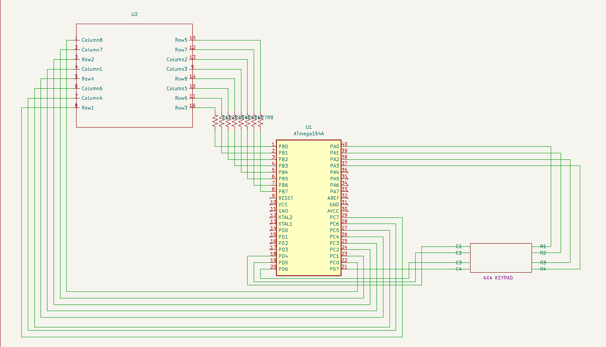
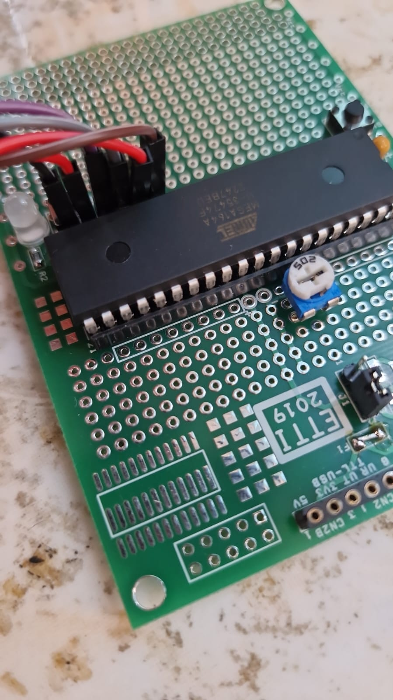
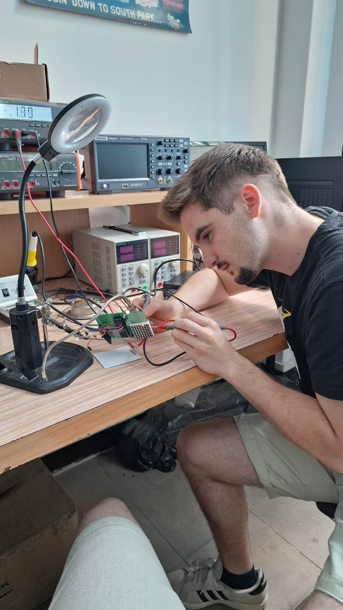
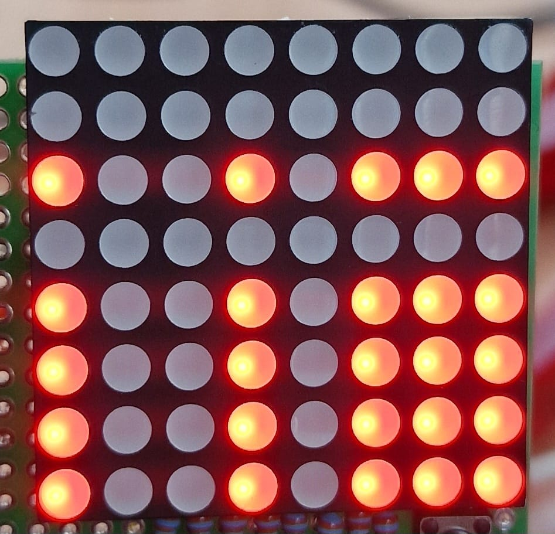
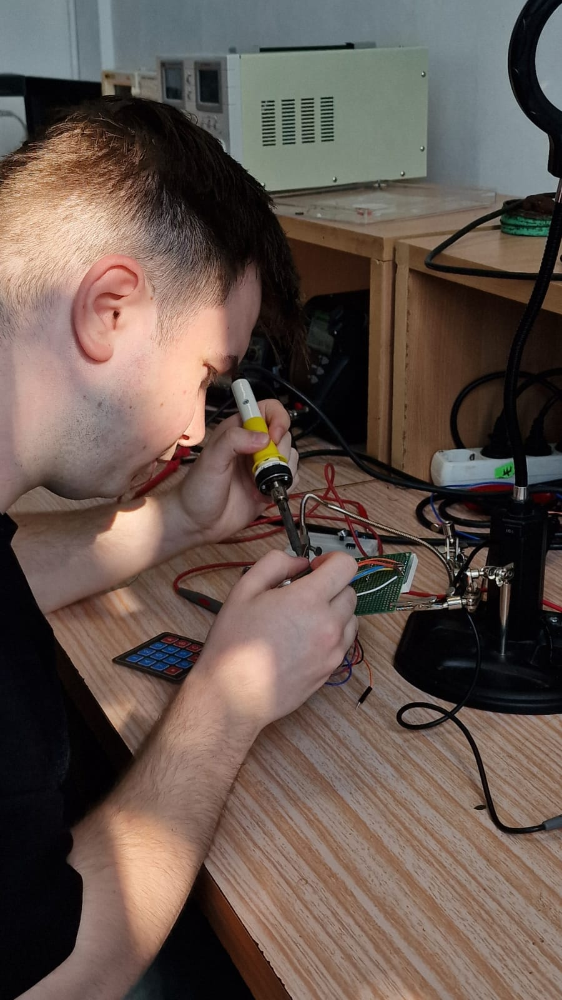
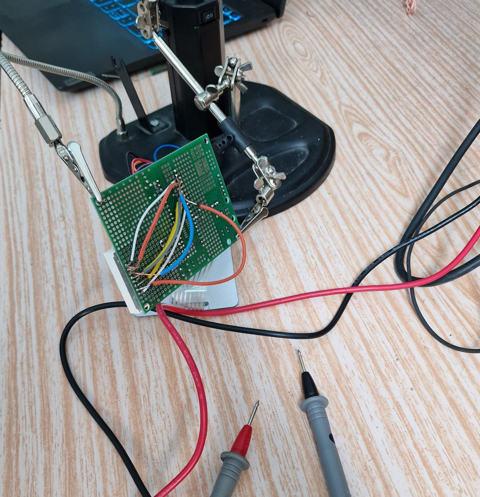
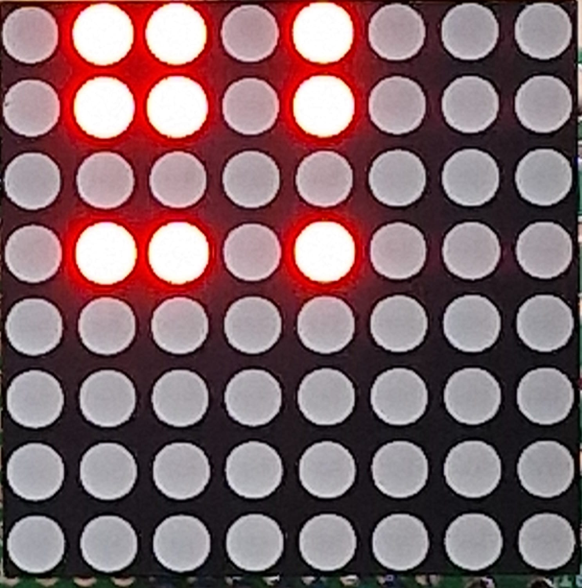
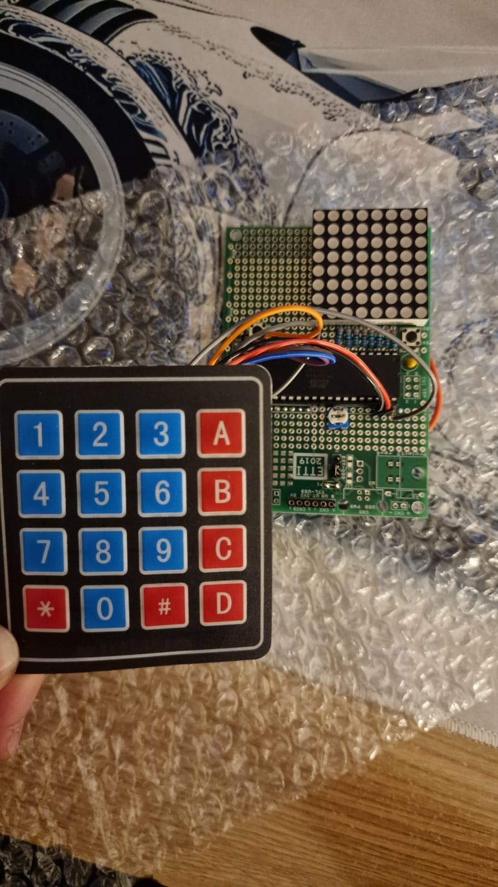
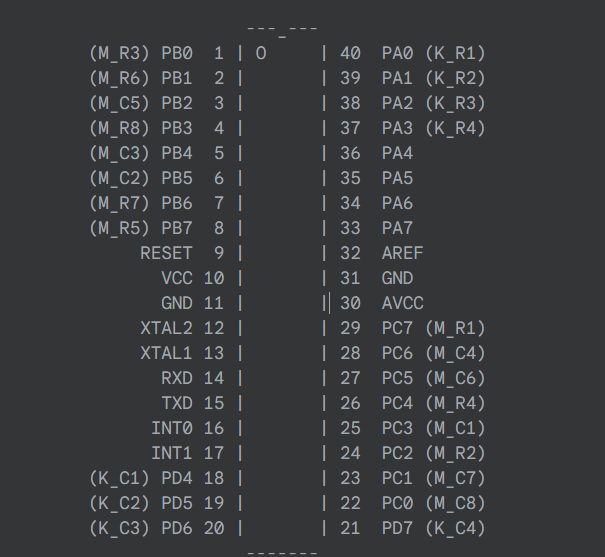

# Tic-Tac-Toe  
*A simple game using an LED Matrix and 4x4 Keypad*

## 🛠 Hardware Description

### 📉 Schematics  
The schematic includes all components and connections used in the final board. Created using **KiCad**.  
  
*Fig 1: Circuit schematic for the project.*

---

### 📦 Bill of Materials (BOM)

| Part Ref. | Component Name | Quantity | Description |
|-----------|----------------|----------|-------------|
| U1        | Microcontroller | 1        | ATMega164A (provided by the professor) |
| R1        | Resistor        | 8        | 330 ohm (owned from previous projects) |
| T1        | [4x4 Keypad](https://www.bitmi.ro/componente-electronice/tastatura-matriceala-4x4-keypad-10518.html) | 1 | Only 3x3 section used (3.99 lei) |
| M1        | [Red LED Matrix](https://www.bitmi.ro/componente-electronice/matrice-led-rosie-max7219-8-x-8-3-75mm-10482.html) | 1 | 8x8, 3.75mm, common cathode (7.99 lei) |
| C1        | [USB to UART CH340G](https://www.optimusdigital.ro/ro/interfata-convertoare-usb-la-serial/591-convertor-ch340g-la-uart.html?search_query=ch340) | 1 | Used for USB connectivity (7.99 lei) |

---

### 📸 Board Photos

#### Early Prototypes  

Click to expand

  
  
  
  
  
  

#### 🧩 Final Board  

---

### ⚙️ Hardware Features

- **Microcontroller:** ATmega164A  
- **Clock Speed:** 8 MHz  
- **Ports Used:**  
  

- **Power Supply:**  
  - 5V regulated from USB  
  - 330Ω resistors on LED matrix cathodes

---

## 💻 Software Description

The system uses an **8x8 LED matrix** for display and a **4x4 keypad** for user input.

### 🔧 Game Engine
The main loop alternates between the player and AI, checking for a win after each move.

### 🖼 Display Driver
Uses a **timer interrupt (`timer0_ovf_isr`)** for multiplexed display — it rapidly updates rows to give a flicker-free image while keeping power consumption low.

### ⌨️ Input Scanner
The `get_key()` function scans the keypad by pulling rows low one at a time and detecting column connections to identify pressed keys. A keymap translates button presses to game moves (1–9).

### 🧠 Computer AI
- Blocks player wins and tries to win with two-in-a-row.
- Picks any available move if no threat or opportunity is detected.

When a game ends, the result is shown on the LED matrix, and the system waits for a keypress to start again.

---

## ✅ Results and Conclusions

### 🔍 Results
- Successfully illuminated the LED matrix.
- Correct player input registration and AI responses.
- Stable timing and power management with no glitches.

### 📌 Conclusions
- **ATmega164A** handles LED matrix control via GPIO multiplexing efficiently.
- Software design is stable, with no need for external LED drivers.
- Simple AI provides engaging gameplay.

---

## 📚 Bibliography

1. ATMega164A Datasheet  
2. [YouTube - 8x8 LED Matrix Basics](https://www.youtube.com/watch?v=V5dMnbwkcWQ)  
3. [FILS - Applied Electronics Course](http://ham.elcom.pub.ro/FILS/)

---
